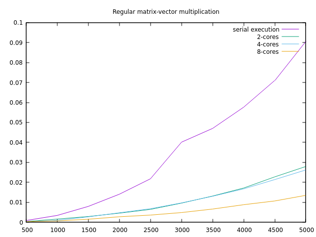
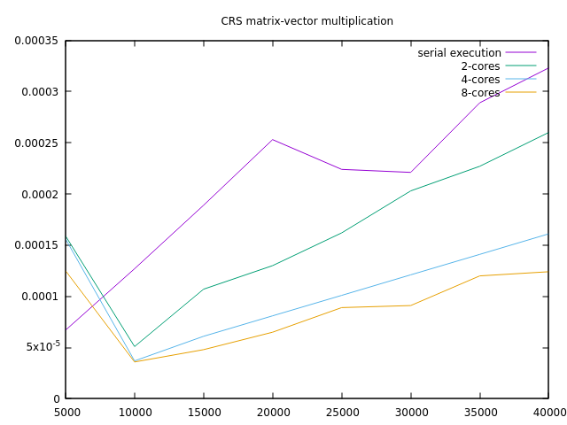
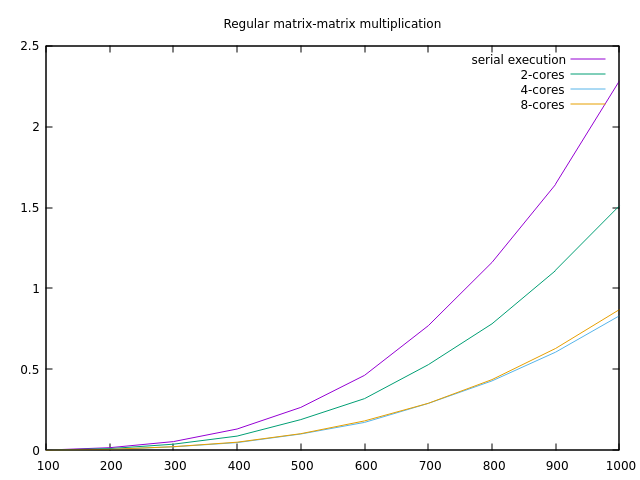
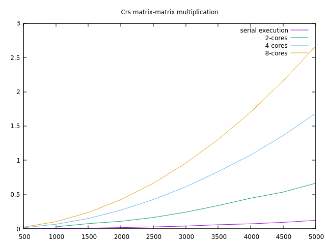
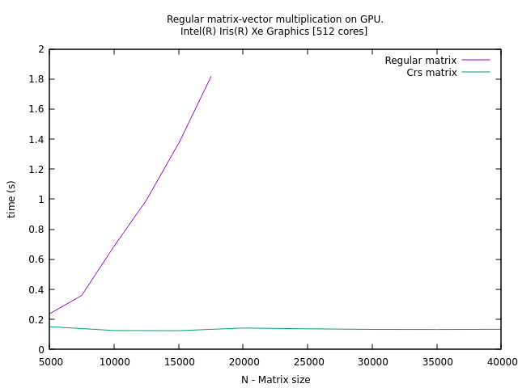

Lymarenko Lev Programming assignment #1
===

# Graphs

x axis is Matrix size, y axis is time in seconds

+ Comparasing of time consuming for **regular matrix - vector** multiplication


+ Comparasing of time consuming for **CRS matrix - vector** multiplication


+ Comparasing of time consuming for **regular matrix - matrix** multiplication



+ Comparasing of time consuming for **CRS matrix - matrix** multiplication
> For some reason, serial execution is better than parallel one. I think the reason is that crs-crs multiplication needs a lot synchronization (`#pramga omp atomic`). 



+ Comparasing of time consuming for **regular matrix - matrix** multiplication on GPU


 

# Code

Code can be found here:

https://github.com/sevenzing/hpc/tree/master/hw1


# Program output

```bash
$ gcc -Wall -Wextra -fopenmp -l OpenCL -l m main.c && ./a.out && rm a.out

Lev Lymarenko 
Programmin assignment #01

== CPU INFO ==
Model name:                      11th Gen Intel(R) Core(TM) i7-1185G7 @ 3.00GHz
CPU max MHz:                     4800,0000
CPU min MHz:                     400,0000
CPU(s):                          8
Total online memory:    15,8G

== GPU INFO ==
GPU name: Intel(R) Iris(R) Xe Graphics [0x9a49]
Clock frequency: 1350
Number of shared cores: 512
GRAM: 65536

Task 12. Checking matrix multiplication
For n = 10: correct
For n = 100: correct
For n = 1000: correct

Regular matrix-vector multiplication serials:
500.000000      0.000657
1000.000000     0.002973
1500.000000     0.009045
2000.000000     0.014587
2500.000000     0.022878
3000.000000     0.031667
3500.000000     0.043009
4000.000000     0.058888
4500.000000     0.072878
5000.000000     0.086956

Regular matrix-vector multiplication with OMP with 2 core(s):
500.000000      0.000685
1000.000000     0.000992
1500.000000     0.002794
2000.000000     0.004761
2500.000000     0.006510
3000.000000     0.009277
3500.000000     0.012234
4000.000000     0.017285
4500.000000     0.020254
5000.000000     0.025057

Regular matrix-vector multiplication with OMP with 4 core(s):
500.000000      0.000617
1000.000000     0.001212
1500.000000     0.002314
2000.000000     0.002736
2500.000000     0.004266
3000.000000     0.006463
3500.000000     0.006802
4000.000000     0.014980
4500.000000     0.021073
5000.000000     0.025040

Regular matrix-vector multiplication with OMP with 8 core(s):
500.000000      0.000449
1000.000000     0.000219
1500.000000     0.004493
2000.000000     0.006586
2500.000000     0.003928
3000.000000     0.004482
3500.000000     0.006392
4000.000000     0.011937
4500.000000     0.016308
5000.000000     0.015552

Crs matrix-vector multiplication serials:
5000.000000     0.000579
10000.000000    0.000541
15000.000000    0.000420
20000.000000    0.000366
25000.000000    0.000133
30000.000000    0.000324
35000.000000    0.000386
40000.000000    0.000123

Crs matrix-vector multiplication with OMP with 2 core(s):
5000.000000     0.000942
10000.000000    0.000712
15000.000000    0.000864
20000.000000    0.000817
25000.000000    0.000018
30000.000000    0.000533
35000.000000    0.000248
40000.000000    0.000305

Crs matrix-vector multiplication with OMP with 4 core(s):
5000.000000     0.000333
10000.000000    0.001003
15000.000000    0.000776
20000.000000    0.000962
25000.000000    0.000030
30000.000000    0.000409
35000.000000    0.000209
40000.000000    0.000606

Crs matrix-vector multiplication with OMP with 8 core(s):
5000.000000     0.000717
10000.000000    0.000860
15000.000000    0.000012
20000.000000    0.000221
25000.000000    0.000572
30000.000000    0.000160
35000.000000    0.001052
40000.000000    0.000780

Check crs-crs and regular-regular matrix mult
For n=10 is ok
For n=100 is ok
For n=1000 is ok

Regular matrix-matrix multiplication serial:
100.000000      0.002237
200.000000      0.017533
300.000000      0.056363
400.000000      0.141555
500.000000      0.275375
600.000000      0.519305
700.000000      0.856175
800.000000      1.292221
900.000000      1.699906
1000.000000     2.491672

Regular matrix-matrix multiplication with OMP with 2 core(s):
100.000000      0.001223
200.000000      0.012023
300.000000      0.041998
400.000000      0.103610
500.000000      0.201026
600.000000      0.323173
700.000000      0.587436
800.000000      0.895732
900.000000      1.115143
1000.000000     1.696976

Regular matrix-matrix multiplication with OMP with 4 core(s):
100.000000      0.001271
200.000000      0.005762
300.000000      0.024777
400.000000      0.065362
500.000000      0.181000
600.000000      0.284144
700.000000      0.432832
800.000000      0.474093
900.000000      0.682509
1000.000000     1.022434

Regular matrix-matrix multiplication with OMP with 8 core(s):
100.000000      0.000036
200.000000      0.006081
300.000000      0.022651
400.000000      0.059626
500.000000      0.108683
600.000000      0.199124
700.000000      0.306068
800.000000      0.471647
900.000000      0.645764
1000.000000     0.939272

Crs matrix-matrix multiplication serial:
500.000000      0.001728
1000.000000     0.006025
1500.000000     0.015771
2000.000000     0.023203
2500.000000     0.031205
3000.000000     0.048909
3500.000000     0.061786
4000.000000     0.079480
4500.000000     0.100796
5000.000000     0.123932

Crs matrix-matrix multiplication with OMP with 2 core(s):
500.000000      0.006528
1000.000000     0.026674
1500.000000     0.059337
2000.000000     0.101763
2500.000000     0.156267
3000.000000     0.234543
3500.000000     0.339526
4000.000000     0.377489
4500.000000     0.491969
5000.000000     0.589688

Crs matrix-matrix multiplication with OMP with 4 core(s):
500.000000      0.014477
1000.000000     0.061320
1500.000000     0.142571
2000.000000     0.248984
2500.000000     0.419319
3000.000000     0.579220
3500.000000     0.807436
4000.000000     1.043445
4500.000000     1.365257
5000.000000     1.456655

Crs matrix-matrix multiplication with OMP with 8 core(s):
500.000000      0.027140
1000.000000     0.106740
1500.000000     0.230305
2000.000000     0.430750
2500.000000     0.651062
3000.000000     0.974470
3500.000000     1.302617
4000.000000     1.693087
4500.000000     2.151051
5000.000000     2.607500

Task 25. Checking matrix multiplication on GPU
For n = 10: correct
For n = 100: correct
For n = 1000: correct

Reg matrix-vector multiplication on GPU:
5000.000000     0.006835
7500.000000     0.015621
10000.000000    0.022903
12500.000000    0.033441
15000.000000    0.059487

Task 28. Checking CRS matrix multiplication on GPU
For n = 10: correct
For n = 100: correct
For n = 1000: correct

Crs matrix-vector multiplication on GPU:
5000.000000     0.134675
10000.000000    0.143143
15000.000000    0.134133
20000.000000    0.139893
25000.000000    0.134152
30000.000000    0.141777
35000.000000    0.136675
40000.000000    0.143805

Task 28. Checking CRS matrix multiplication on GPU
For n=10 is ok
For n=100 is ok
For n=1000 is ok
```